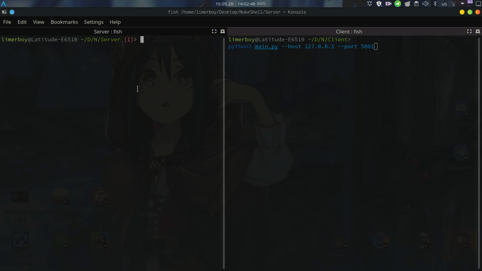

### :loudspeaker: I created this while learning how sockets and cryptography work in python. So bugs are possible.

<p align="center">
  <br>
</p>

## :gear: Commands
  :cop: _Run server:_
  ``` bash
  python3 Server/main.py --port 5050
  ```
  :construction_worker: _Run client:_
  ``` bash
  python3 Client/main.py --host 127.0.0.1 --port 5050
  ```

## :tada: Features
- [x] Connection is encrypted using random RSA + AES key
- [x] Multiple clients support
- [x] Execute shell commands
- [x] Download/Upload files
- [x] Take screenshot
- [x] Cross platform

## :computer: Example
<p align="center">
  <br>
</p>

